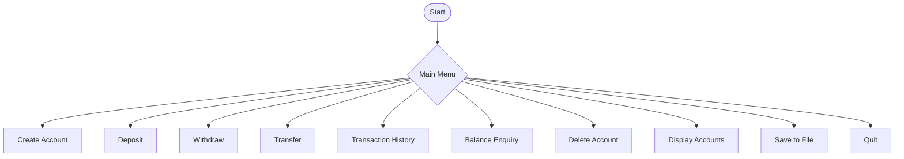
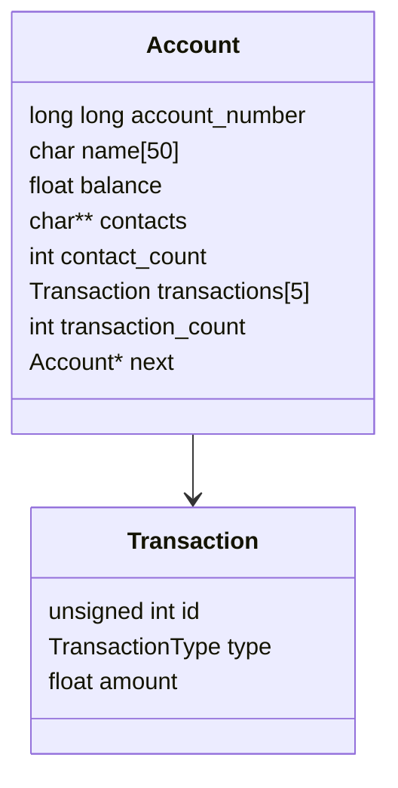

# 💳 Bank Management System in C 🏦

A **console-based mini project** written in C language that simulates basic banking functionalities like creating accounts, depositing/withdrawing money, transferring funds, tracking transactions, multiple contact support and account deletion!

---

## 🧠 Features

✅ Create Account with multiple 📱 contact numbers  
✅ Deposit & Withdraw money 💸  
✅ Transfer money between accounts 🔁  
✅ Maintain last 5 transactions 📜  
✅ Save & Load data to file 💾  
✅ Delete Account permanently ❌  
✅ Display All Accounts 👀  
✅ Error handling for invalid inputs 🚫  

---

## 📊 Functional Flow Diagram



---

## 📐 Data Structure Overview



---

## 🧑‍💻 How to Compile & Run

### 🔧 Compile
```bash
make
```

### ▶️ Run
```bash
./bankapp
```

---

## 🧪 Sample Input/Output

```txt
==================================== BANK MANAGEMENT SYSTEM ====================================
c: Create account	h: Transaction history	w: Withdraw
d: Deposit		b: Balance enquiry	t: Transfer
e: Display accounts	s: Save to file		f: Find account
x: Delete Account	q: Quit
Enter choice: 

```

---

## 🌱 Future Enhancements

✨ Add login authentication  
✨ Support interest calculation  
✨ Export data as CSV  
✨ GUI version using C++/GTK  

---

## 👨‍💻 Author

- 🎓 Developed by: *P.Teja Anand*
- 🏫 Mini Project Submission
- 🎯 Tech: C language, File Handling, Linked Lists, Pointers

---

## 📷 Screenshots (Optional)

> You can add terminal screenshots or a demo video here!
